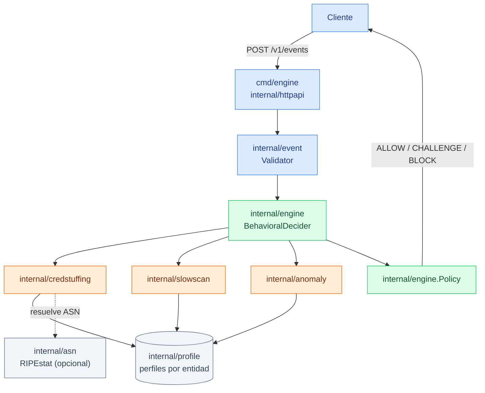
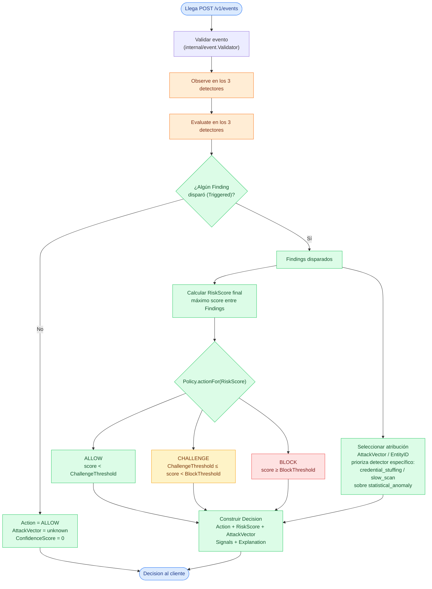
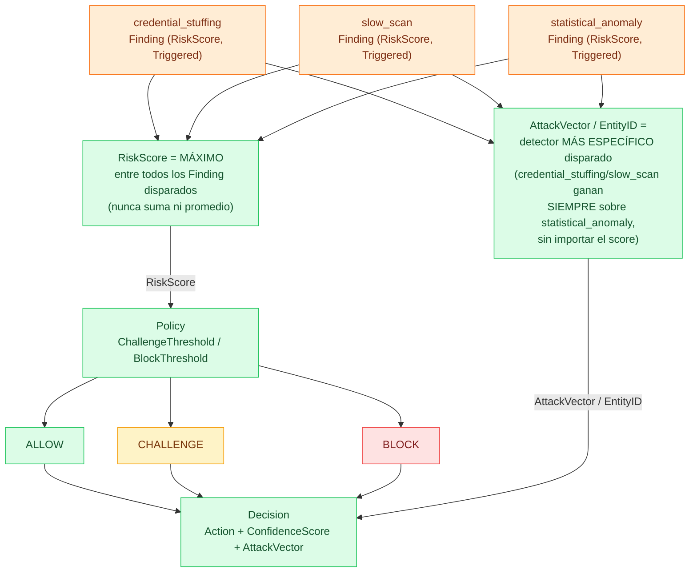
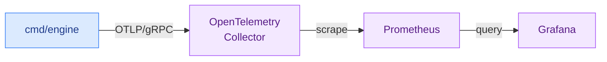
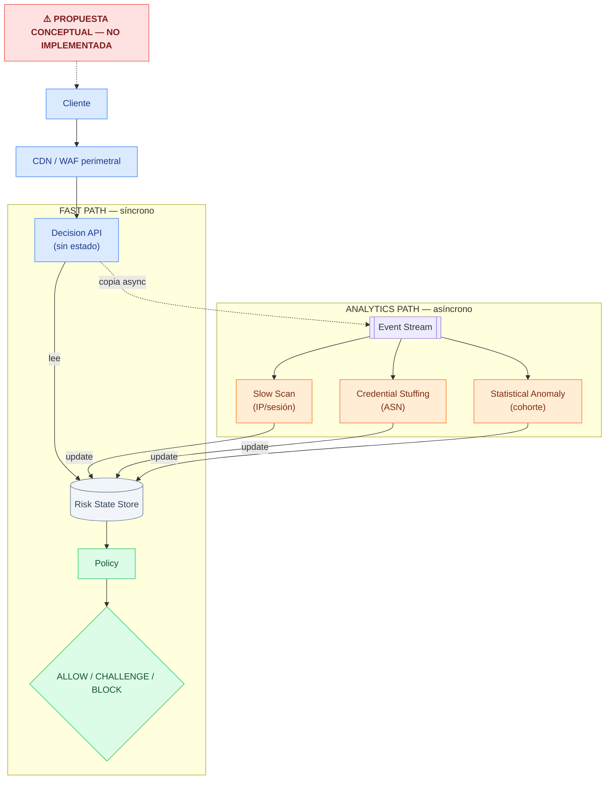

# WAF Behavior Engine

Motor de decisión en Go que analiza metadata de tráfico HTTP (nunca el tráfico
en vivo) y detecta dos categorías de ataque de baja intensidad —
**credential stuffing distribuido** y **enumeración / escaneo lento** — mediante
reglas conductuales por entidad, correlación entre entidades y un detector
estadístico de anomalías, combinados en una única decisión `ALLOW` /
`CHALLENGE` / `BLOCK` con explicación y observabilidad completa.

## Índice

1. [El problema que resuelve](#el-problema-que-resuelve)
2. [Arquitectura actual](#arquitectura-actual)
3. [Cómo funciona una decisión](#cómo-funciona-una-decisión)
4. [Detectores](#detectores)
5. [Modelo de decisión](#modelo-de-decisión)
6. [Estructura del repositorio](#estructura-del-repositorio)
7. [Requisitos](#requisitos)
8. [Inicio rápido](#inicio-rápido)
9. [API HTTP](#api-http)
10. [Generación de tráfico sintético y ground truth](#generación-de-tráfico-sintético-y-ground-truth)
11. [Evaluación y métricas](#evaluación-y-métricas)
12. [Reproducibilidad: herramientas disponibles](#reproducibilidad-herramientas-disponibles)
13. [Observabilidad](#observabilidad)
14. [Performance](#performance)
15. [Resultados finales](#resultados-finales)
16. [Limitaciones conocidas](#limitaciones-conocidas)
17. [Escalado conceptual a 1.000 millones de requests/hora](#escalado-conceptual-a-1000-millones-de-requestshora)
18. [Comandos útiles](#comandos-útiles)

## El problema que resuelve

Un WAF tradicional bloquea por firma o por volumen (rate limiting). Eso no
alcanza contra dos patrones de ataque que se mueven deliberadamente lento y
distribuido para parecer tráfico normal:

- **Credential stuffing distribuido**: miles de intentos de login con
  credenciales robadas, repartidos entre muchas IPs (a menudo del mismo rango
  de red / ASN) para que ninguna IP individual dispare un rate limit.
- **Enumeración / escaneo lento**: un atacante que mantiene una tasa baja de
  requests explorando rutas (buscando endpoints, IDs o recursos expuestos),
  precisamente para evitar cualquier límite por volumen.

Un rate limiter tradicional por IP (`internal/baseline`, incluido en este
repo como línea base de comparación) no ve estos patrones porque cada IP
individual nunca cruza el umbral. Hace falta mirar el comportamiento
agregado de una entidad (IP, sesión, grupo de red) a lo largo del tiempo, no
un conteo aislado por request.

## Arquitectura actual

Esta es la arquitectura **implementada y en funcionamiento hoy** — un único
proceso Go, sin infraestructura distribuida. (La sección
[Escalado conceptual](#escalado-conceptual-a-1000-millones-de-requestshora)
describe una propuesta *sin implementar* para volúmenes mucho mayores; no la
confundas con esto.)



*(El detalle de cómo se combinan los tres `Finding` en una sola `Decision`
está en el diagrama de la sección [Modelo de decisión](#modelo-de-decisión);
el pipeline de métricas está en [Observabilidad](#observabilidad).)*

Todo el estado (perfiles de comportamiento por IP/sesión, baseline
estadístico, caché de ASN) vive en memoria, dentro de un único proceso. No
hay base de datos ni cola de mensajes.

## Cómo funciona una decisión

1. Llega un `POST /v1/events` con la metadata de un request HTTP que **ya
   ocurrió** (nunca tráfico en vivo interceptado).
2. `internal/event.Validator` lo valida (campos obligatorios, rango de
   fecha, IP pública, etc. — ver [docs/formato-eventos.md](docs/formato-eventos.md)).
3. `BehavioralDecider.Decide` le pasa el evento a los tres detectores. Cada
   uno actualiza su propio estado por entidad y, si corresponde, dispara un
   `Finding` con un `RiskScore` (0–1).
4. Si hay uno o más `Finding` disparados: el `ConfidenceScore` de la
   decisión es el **mayor** `RiskScore` entre todos ellos. El
   `AttackVector`/`EntityID`/explicación, en cambio, **siempre prefieren un
   detector específico** (`credential_stuffing` o `slow_scan`) sobre
   `statistical_anomaly`, aunque la anomalía tenga mayor score — así la
   decisión nunca queda atribuida a "anomalía genérica" cuando en realidad
   hay un ataque identificado con nombre y contexto propio.
5. `engine.Policy` convierte el score en `ALLOW` / `CHALLENGE` / `BLOCK`
   según dos umbrales (`ChallengeThreshold`, `BlockThreshold`).
6. La respuesta HTTP incluye la decisión y una explicación en texto.



Como los tres detectores dependen del **historial** de la entidad, una sola
request aislada casi nunca alcanza para disparar `CHALLENGE`/`BLOCK` — ver
[API HTTP](#api-http) para cómo reproducir esos casos correctamente.

## Detectores

### Credential Stuffing (`internal/credstuffing`)

Correlaciona intentos de login **entre IPs del mismo grupo de red (ASN)**
dentro de una ventana deslizante, combinando cuatro señales normalizadas:
diversidad de IPs distintas, diversidad de cuentas probadas, volumen de
intentos y ratio de fallos. Configuración final congelada (**CSw2**):
`Window=90m`, `MinDistinctIPs=16` (resto en su default).

### Slow Scan (`internal/slowscan`)

Detecta enumeración lenta de rutas por IP y/o por sesión: combina ratio de
`404`, diversidad/novedad de rutas visitadas (contra la popularidad global
de cada ruta) y entropía de la secuencia. Configuración final congelada
(**S3**): `MaxVisitorsForNovelPath=3`, `MinNovelPathRatio=0.35`.

### Statistical Anomaly (`internal/anomaly`)

El único detector no basado en reglas fijas: mantiene un baseline
estadístico global (media/varianza online, algoritmo de Welford) sobre un
vector de features por entidad y calcula z-scores. Una muestra que dispara
la anomalía **nunca se usa para actualizar el baseline** (si se usara, un
ataque sostenido terminaría "normalizándose" a sí mismo). Configuración
final congelada (**A3**): `AccountDiversityWeight=0.5`.

Los tres detectores, sus umbrales y el porqué de cada decisión de diseño
están documentados en detalle en [docs/decisiones.md](docs/decisiones.md).

## Modelo de decisión



`RiskScore` y `AttackVector` se seleccionan por **criterios distintos**,
nunca del mismo `Finding` por definición: el score siempre es el máximo,
la atribución siempre prefiere el detector más específico — son dos
preguntas independientes ("qué tan riesgoso" vs. "de qué ataque se
trata").

- **`ScoreFloor`** (por detector): sin este piso, las señales de un gate
  exactamente en su umbral darían componentes en 0, y un `Finding` disparado
  no podría reportar riesgo cero — cada detector define el suyo, sin
  cambios desde la calibración.
- **`engine.Policy`**: dos umbrales sobre el `ConfidenceScore` —
  `ChallengeThreshold=0.50`, `BlockThreshold=0.75` (valores finales,
  congelados tras el holdout).
- **`internal/wiring.FinalConfigs()` / `FinalPolicy()`**: única fuente de
  verdad de esta configuración final — tanto `cmd/engine` (producción) como
  `cmd/loadtest` (medición) la consumen de ahí, para que nunca puedan
  divergir silenciosamente.

Ningún threshold cambió después del holdout final (ver
[Resultados finales](#resultados-finales)) — los valores de arriba son los
que sirve el motor hoy, sin excepción.

## Estructura del repositorio

```
cmd/            Binarios ejecutables (uno por herramienta, ver tabla en
                "Reproducibilidad")
internal/       Paquetes de dominio — cada uno con responsabilidad única
  engine/       BehavioralDecider, Policy, orquestación de detectores
  credstuffing/ slowscan/  anomaly/   Los tres detectores
  profile/      Perfiles de comportamiento por entidad, en memoria
  asn/          Enriquecimiento de IP → ASN (RIPEstat)
  event/        Contrato del evento HTTP y su validación
  decision/     Contrato de la decisión (ALLOW/CHALLENGE/BLOCK)
  httpapi/      Capa HTTP (POST /v1/events, GET /healthz)
  telemetry/    Integración con OpenTelemetry
  datagen/      Generador de tráfico sintético + ground truth
  groundtruth/  Formato del ground truth (aislado del motor)
  eval/         Evaluador genérico (decisions.jsonl vs. ground truth)
  baseline/     Rate limiter tradicional (línea base de comparación)
  tuning/       Evaluación del motor real, reportes y holdout
  loadtest/     Cliente de carga para el load test HTTP
  wiring/       Ensamblado de la configuración final congelada
docs/           Decisiones técnicas, contrato de eventos, escalado conceptual
otel/ prometheus/ grafana/   Configuración del stack de observabilidad local
data/ reports/  Generados localmente, en .gitignore — nunca se commitean
```

## Requisitos

Para **ejecutar el proyecto** (motor, tests, generación de datos,
evaluación, calibración):

- Go **1.25.14** o compatible (el `go.mod` fija esa versión; el challenge
  exige Go 1.22 o superior, así que se cumple con margen).
- Sin dependencias externas para el runtime — el binario `cmd/engine` no
  necesita Docker ni ningún servicio corriendo.

Adicional, solo si querés observabilidad (opcional, nunca requerido para
correr el motor):

- Docker 27.x + Docker Compose v2 (`docker compose`, sin guion — es la
  sintaxis vigente, verificada en este entorno).

El **entorno usado para medir performance** (sección
[Performance](#performance)) es distinto y se documenta ahí aparte: Apple
M3, 16 GB RAM, macOS 15.6.1 (Darwin 24.6.0), Go 1.25.14 — esos números no
son un requisito, son el contexto de la medición.

## Inicio rápido

```bash
# 1. Descargar dependencias
go mod download

# 2. Correr todos los tests (con el detector de carreras habilitado)
make test          # equivalente a: go test -race ./...

# 3. Levantar el motor
go run ./cmd/engine --addr :8080

# 4. En otra terminal: verificar que está vivo
curl localhost:8080/healthz
# {"status":"ok"}

# 5. Enviar un evento
NOW=$(date -u +"%Y-%m-%dT%H:%M:%SZ")

curl -s --location 'http://localhost:8080/v1/events' \
  --header 'Content-Type: application/json' \
  --data "{
    \"request_id\": \"r-1\",
    \"timestamp\": \"$NOW\",
    \"client_ip\": \"203.0.113.7\",
    \"method\": \"GET\",
    \"path\": \"/\",
    \"status_code\": 200
  }" | jq
```

No hace falta generar ningún archivo antes de este paso — `cmd/engine` no
depende de `data/` ni de `reports/`.

## API HTTP

### `GET /healthz`

```json
{"status":"ok"}
```

### `POST /v1/events`

Request (campos obligatorios: `request_id`, `timestamp`, `client_ip`,
`method`, `path`, `status_code` — contrato completo, con todos los campos
opcionales y las reglas de validación, en
[docs/formato-eventos.md](docs/formato-eventos.md)):

El `timestamp` tiene que estar dentro de la tolerancia de pasado del
validator (un valor fijo viejo se rechaza con `timestamp is older than
allowed past tolerance`), así que se genera al momento; `client_ip` debe
ser una dirección pública (las privadas/loopback se rechazan):

```bash
NOW=$(date -u +"%Y-%m-%dT%H:%M:%SZ")

curl -X POST localhost:8080/v1/events \
  -H "Content-Type: application/json" \
  -d "{
    \"request_id\": \"r-1\",
    \"timestamp\": \"$NOW\",
    \"client_ip\": \"203.0.113.7\",
    \"method\": \"GET\",
    \"path\": \"/\",
    \"status_code\": 200
  }"
```

Respuesta (verificada contra el servicio real corriendo local):

```json
{
  "request_id": "r-1",
  "timestamp": "2026-09-29T15:31:17Z",
  "entity_id": "ip:203.0.113.7",
  "action": "ALLOW",
  "confidence_score": 0,
  "attack_vector": "unknown",
  "explanation": "no behavioral detector flagged this request"
}
```

**Por qué no hay acá un ejemplo de `CHALLENGE`/`BLOCK` con requests
sueltas**: los tres detectores son conductuales — necesitan historial real
de una entidad (docenas de requests correlacionadas en el tiempo, muchas
veces entre varias IPs) para disparar. `curl` aislados nunca van a
reproducir eso de forma representativa. Para ver `CHALLENGE`/`BLOCK` reales:

1. Genera un escenario con tráfico malicioso: `make data-10` (10% malicioso)
   o `make data-30` (30%).
2. Los eventos de `data/scenario-10/events.jsonl` son exactamente lo que el
   motor recibiría, en el orden correcto — se pueden reproducir contra
   `cmd/engine` uno por uno.

## Generación de tráfico sintético y ground truth

```bash
make data-all           # genera los 3 escenarios: 0%, 10% y 30% malicioso
# o individualmente:
make data-0             # equivalente a: go run ./cmd/datagen --seed 42 --ratio 0
make data-10
make data-30
```

Cada corrida es **determinista** (misma semilla = mismos archivos) y
escribe, bajo `data/scenario-{0,10,30}/` (en `.gitignore`, se regenera
siempre con el comando de arriba, nunca se commitea):

- **`events.jsonl`** — un evento por línea, exactamente lo que recibiría el
  motor. Sin ninguna etiqueta.
- **`labels.jsonl`** — el **ground truth**: `request_id` + `label`
  (`legit` / `credential_stuffing` / `slow_scan`) para cada evento. El motor
  de detección **nunca** importa este archivo ni el paquete que lo define
  (`internal/groundtruth`) — ese aislamiento está verificado con tests
  dedicados que inspeccionan por reflexión los campos de `Event` y el JSON
  serializado.
- **`manifest.json`** — semilla, configuración y estadísticas reales de esa
  generación.

`--ratio` acepta `0`, `10` o `30` (el porcentaje de tráfico malicioso que
exige el enunciado del challenge); `--seed` es cualquier entero.

## Evaluación y métricas

Hay **dos caminos de evaluación** en este repo, con propósitos distintos —
importante no confundirlos:

**1. Evaluador genérico (`cmd/eval` + `cmd/baseline`)**. `cmd/eval` compara
cualquier `decisions.jsonl` contra el `labels.jsonl` de un escenario y arma
un reporte Markdown con Precision/Recall/F1/FPR. Hoy, el único productor de
`decisions.jsonl` en el repo es `cmd/baseline` (el rate limiter tradicional
de comparación, no el motor conductual):

```bash
make data-30                                              # si no existe todavía
make baseline SCENARIO=data/scenario-30 BASELINE_OUT=data/scenario-30/decisions.jsonl
make eval SCENARIO=data/scenario-30 OUT=reports/scenario-30.md
```

**2. Evaluación del motor conductual real (`cmd/holdout`, y `cmd/tune` para
la línea base previa a la calibración)**. Estas corren
`BehavioralDecider` de verdad sobre sus propios escenarios generados en
memoria y calculan las métricas directamente (sin pasar por
`decisions.jsonl`) — este es el camino que produjo los
[Resultados finales](#resultados-finales) de abajo. Ver la tabla de la
siguiente sección.

## Reproducibilidad: herramientas disponibles

Las 7 herramientas de `cmd/`, en el orden en que un evaluador las usaría.
`cmd/engine`, `cmd/datagen`, `cmd/baseline`, `cmd/eval` y `cmd/loadtest`
aceptan `--help`; `cmd/tune` y `cmd/holdout` corren siempre con las semillas
y escenarios ya fijados en su código (así quedaron congelados junto con la
configuración que produjeron):

Flujo recomendado para un evaluador:

```bash
make test                                                  # tests con -race
make data-all                                              # datagen: escenarios 0/10/30%
make baseline SCENARIO=data/scenario-30 BASELINE_OUT=data/scenario-30/decisions.jsonl
make eval SCENARIO=data/scenario-30                        # baseline vs. ground truth
make holdout                                               # motor conductual final, seeds 201/202/203
make perf                                                  # performance
make run                                                   # servicio HTTP
```

| Paso | Herramienta | Qué hace | Comando |
|---|---|---|---|
| Datos | `cmd/datagen` | Genera escenarios sintéticos (0%, 10%, 30%) con `events.jsonl`, `labels.jsonl` y `manifest.json` | `make data-all` |
| Baseline de rate limiting | `cmd/baseline` | Rate limiter tradicional por IP, para mostrar sus límites frente a credential stuffing distribuido y slow scan | `make baseline` |
| Evaluación genérica | `cmd/eval` | Compara cualquier `decisions.jsonl` contra el ground truth (TP/FP/TN/FN, precision, recall, FPR) | `make eval` |
| Línea base conductual *(secundaria)* | `cmd/tune` | Corre el motor con los defaults originales (previos a la calibración) sobre los escenarios de tuning (seeds 101/102/103). No calibra ni elige candidatos | `make tune-baseline` |
| Evaluación final | `cmd/holdout` | Baseline original vs. configuración final congelada, sobre seeds separadas (201/202/203) y sobre tuning | `make holdout` |
| Performance | `cmd/loadtest` | Microbenchmark + load test HTTP | `make perf` |
| Runtime | `cmd/engine` | El servicio HTTP del Behavioral WAF | `make run` |

Los reportes se escriben bajo `reports/` (Markdown, y algunos también
CSV/JSON) — carpeta en `.gitignore`: **se regenera corriendo estas
herramientas, nunca se versiona**. Los resultados finales que importan ya
están resumidos en este README (sección
[Resultados finales](#resultados-finales)) y en
[docs/decisiones.md](docs/decisiones.md), así que no hace falta correr nada
para leerlos. Las grillas de candidatos que se exploraron durante la
calibración están en el Apéndice A de `docs/decisiones.md`.

`cmd/holdout` usa semillas fijas y se corrió por primera vez una vez que
toda la configuración quedó congelada: es determinista, así que volver a
correrlo reproduce el mismo reporte. No se usa para ajustar thresholds —
ninguno cambió ni debe cambiar en función de sus resultados.

## Observabilidad

```bash
docker compose up -d otel-collector prometheus grafana
go run ./cmd/engine --addr :8080 --otel-endpoint localhost:4317 --otel-insecure
```



*Fail-open: sin `--otel-endpoint`, o si el Collector no responde al
arrancar, `cmd/engine` usa instrumentación no-op y sirve tráfico
exactamente igual — un Collector caído nunca impide que el motor responda.*

- **Grafana**: [http://localhost:3000](http://localhost:3000) (login
  anónimo habilitado solo para esta demo local, con rol de solo lectura;
  dashboard `waf-engine` provisto automáticamente).
- **Prometheus**: [http://localhost:9090](http://localhost:9090) (scrapea
  al Collector, nunca directamente a `cmd/engine`).
- El Collector recibe métricas OTLP/gRPC en `:4317` y las expone en
  formato Prometheus en `:8889`.

Métricas exportadas: `waf.decisions`, `waf.detector.findings`,
`waf.anomaly.score`, `waf.asn.cache`, `waf.asn.resolve`,
`waf.asn.provider.duration`. Sin `--otel-endpoint`, el motor usa
instrumentación no-op y sirve tráfico exactamente igual (fail-open: la
observabilidad nunca puede impedir que el motor arranque o responda).

`waf.anomaly.score` es un Histogram con el `RiskScore` de
`statistical_anomaly` en **cada** evaluación (dispare o no, siempre 0
cuando no dispara) — sin atributos, para no agregar cardinalidad. El
dashboard incluye un panel con su p50/p95 en el tiempo.

### Requisito de observabilidad del challenge → implementación real

| Requisito | Implementación | Explicación |
|---|---|---|
| `requests_analyzed_total` | **Equivalente**: `waf_decisions_total` (suma de todas las series) | Cada request analizada produce exactamente una decisión — la suma es el total. |
| `decisions_by_action_total` | **Equivalente**: `waf_decisions_total{action="..."}` | Un único Counter con label `action`, no un contador por acción — es la forma idiomática de Prometheus/OTel de expresar lo mismo (`sum by (action) (...)`). |
| `fp_rate` | **Pipeline offline** (`cmd/eval`, `cmd/tune`, `cmd/holdout` — ver [Resultados finales](#resultados-finales)) | Un falso positivo requiere ground truth, y el motor nunca tiene acceso a ground truth en runtime (aislamiento verificado con tests) — cualquier FPR calculado en vivo sería una proxy inventada, no un valor real. El FPR correcto se calcula en la evaluación offline contra datasets con ground truth conocido. |
| `anomaly_score_histogram` | **`waf.anomaly.score`** (nuevo histograma runtime) | Ver arriba. |
| `model_inference_duration` | **No aplica** | No existe un modelo ML entrenado — `internal/anomaly` es estadístico (Welford + z-scores), sin fase de inferencia que medir. |
| `llm_call_duration` | **No aplica** | El proyecto no implementa LLM en runtime — `decision.LLMExplanation` existe como campo del contrato, pero esa capacidad nunca se implementó. |

## Performance

Dos medidas, con harness propio en `cmd/loadtest` (`make perf-bench`,
`make perf-load`, `make perf-load-otel`, `make perf` — ver
[Comandos útiles](#comandos-útiles)):

**Microbenchmark de `BehavioralDecider.Decide()`** (aislado, sin red):
≈9.7–10.5 μs/op, ≈16 KB/op, 45–46 allocs/op, según el perfil de tráfico
(legítimo/mixto/con más ataque).

**Load test HTTP end-to-end** (`POST /v1/events`, matriz perfil ×
concurrencia {1,10,25,50,100}, 3 repeticiones por punto): throughput entre
≈2.000 y ≈3.000 req/s según perfil y concurrencia, **cero errores** en toda
la matriz principal, con saturación (el throughput deja de crecer de forma
significativa) observada alrededor de concurrencia 50.

**Ambos números son de un entorno local (loopback, cliente y servidor
comparten proceso y máquina) — no representan capacidad de un servidor de
producción desplegado por separado, y no se pueden extrapolar linealmente a
"cuántos servidores necesito".**

Comparativo con OpenTelemetry habilitado (Collector local, matriz pareada
OFF→ON): **no se observó overhead material de OpenTelemetry bajo las
condiciones locales probadas** (nunca se afirma "overhead cero" — los
deltas medidos están dentro del rango de variabilidad normal entre
repeticiones).

## Resultados finales

Estos son los resultados del **holdout final** (seeds 201/202/203, nunca
vistos durante la calibración — primera y única corrida, configuración ya
congelada). Son los resultados que importan; los de tuning fueron solo para
calibrar y no se citan acá como resultado final.

| Tráfico malicioso | Precision | Recall (broad) | F1 (broad) |
|---|---|---|---|
| 10% | 0.7182 | 0.9549 | 0.8198 |
| 30% | 0.9621 | 0.8837 | 0.9213 |

| 0% de tráfico malicioso (solo tráfico legítimo) | Valor |
|---|---|
| FPR (broad) | 0.0617 |
| False Block Rate | 0.0008 |
| Eventos legítimos bloqueados (`LegitBlock`) | 3 |

## Limitaciones conocidas

- **El detector de anomalías genera falsos positivos**: al ser un baseline
  estadístico global (no un modelo por usuario), parte del tráfico legítimo
  cae en la cola de la distribución — es la fuente principal del FPR
  distinto de cero incluso al 0% de tráfico malicioso.
- **Hubo bloqueos falsos en el holdout**: 3 eventos legítimos terminaron en
  `BLOCK` (False Block Rate 0.0008) — no es cero, y se documenta así.
- **Credential Stuffing es frágil con baja proporción de tráfico
  malicioso**: su recall propio cae de 0.85 (30% malicioso) a 0.11 (10%) en
  el holdout — la señal de correlación entre IPs necesita volumen para
  distinguirse del ruido.
- **Detection delay inherente**: al ser detección conductual (nunca por
  firma), un ataque necesita generar varias requests antes de que el
  historial acumulado alcance el umbral — nunca se detecta en la primera
  request.
- **RIPEstat no es apto como lookup síncrono a escala**: es una API pública
  gratuita, sin garantía de latencia ni de disponibilidad — aceptable para
  este prototipo (con caché, timeout y fail-open), pero no para un
  volumen de producción alto sin un enriquecimiento asíncrono/propio.
- **El benchmark local no equivale a capacidad de producción** — ver la
  nota explícita en [Performance](#performance).
- **El escalado a 1.000 millones de requests/hora es una propuesta
  conceptual, no implementada** — ver la sección siguiente.

## Escalado conceptual a 1.000 millones de requests/hora

Propuesta conceptual, **sin implementación** — documento completo en
[`docs/scaling-1b-rph.md`](docs/scaling-1b-rph.md). Resumen: separar un
**fast path** síncrono (Decision API sin estado + Risk State Store + Policy)
de un **analytics path** asíncrono (Event Stream + los tres detectores
conductuales, particionados por IP/sesión, ASN y cohorte respectivamente) —
para que cada detector siga viendo todo el historial de una entidad aunque
el tráfico se reparta entre cientos de máquinas.



Ninguna lógica de detección cambia (Policy/ScoreFloor/umbrales calibrados en
el holdout se mantienen exactamente iguales) — lo que cambia es **dónde**
corre esa lógica y **cómo** se reparte el tráfico. El documento completo
cubre, además, la limitación de *cold-start* (una entidad nueva no tiene
historia conductual todavía) y el trade-off explícito de disponibilidad vs.
seguridad ante la caída del Risk State Store (fail-open/fail-closed por
componente).

## Comandos útiles

```bash
# Tests
make test                    # go test -race ./...
go vet ./...
gofmt -l .                   # debe no imprimir nada

# Motor
make run                     # go run ./cmd/engine
go run ./cmd/engine --addr :8080
go run ./cmd/engine --help   # ver todos los flags (ASN, OTel, thresholds)

# Datos sintéticos
make data-all                # los 3 escenarios: 0%, 10%, 30%

# Evaluación genérica (rate limiter tradicional vs. ground truth)
make baseline SCENARIO=data/scenario-10 BASELINE_OUT=data/scenario-10/decisions.jsonl
make eval SCENARIO=data/scenario-10

# Evaluación del motor real (sin flags)
make holdout                 # baseline original vs. configuración final (seeds 201/202/203)
make tune-baseline           # opcional: línea base conductual previa a la calibración

# Performance
make perf-bench              # microbenchmark de Decide()
make perf-load                # load test HTTP, matriz completa
make perf-load-otel           # igual + comparativo OTel (requiere el Collector arriba)

# Observabilidad
docker compose up -d otel-collector prometheus grafana
docker compose down
```
