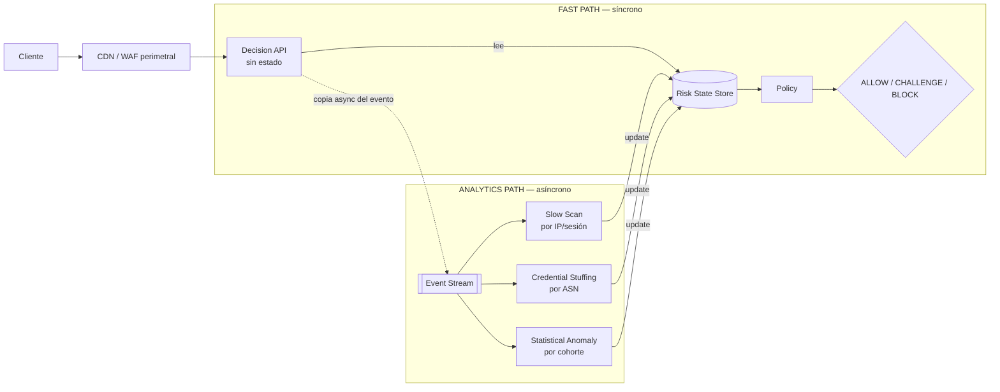

# WAF Behavior Engine

Motor de decisión en Go que analiza metadata de tráfico HTTP y detecta dos
categorías de ataque de baja intensidad — **credential stuffing distribuido**
y **enumeración / escaneo lento** — mediante técnicas multicapa (reglas
conductuales, correlación entre entidades y un modelo de anomalías), con
explicación de cada decisión y observabilidad completa.

> **Estado:** en construcción (Fase 0 — datos de prueba y evaluación).
> Este README se completa a medida que avanzan las fases del proyecto.

## Entorno de pruebas

| | |
|---|---|
| Hardware | Apple M3, 16 GB RAM |
| Sistema operativo | macOS (Darwin 24.6.0) |
| Go | 1.23.1 (darwin/arm64) |
| Docker | 27.3.1 |
| Git | 2.39.5 |

## Cómo ejecutar

> Sección mínima — se completa a medida que avancen las tareas de la Fase 1.

### Servicio HTTP (`cmd/engine`)

Todavía sin detectores conductuales: `POST /v1/events` siempre responde `ALLOW`.

```
go run ./cmd/engine --addr :8080
```

```
curl -X POST localhost:8080/v1/events \
  -H "Content-Type: application/json" \
  -d '{"request_id":"r-1","timestamp":"2026-09-25T10:00:00Z","client_ip":"203.0.113.7","method":"GET","path":"/","status_code":200}'

curl localhost:8080/healthz
```

El resto de las herramientas (`cmd/datagen`, `cmd/eval`, `cmd/baseline`) se documentan más adelante.

### Reproducir los perfiles 0% / 10% / 30% y su ground truth

```
make data-all
```

Genera, de forma determinista (misma semilla siempre = mismo resultado), los tres escenarios de tráfico bajo `data/scenario-{0,10,30}/`:

- `events.jsonl` — un evento por línea, exactamente lo que recibiría el motor (sin ninguna etiqueta).
- `labels.jsonl` — el ground truth: `request_id` + `label` (`legit`/`credential_stuffing`/`slow_scan`) para cada evento, en un archivo que el motor nunca lee.
- `manifest.json` — semilla, configuración y estadísticas reales de esa generación.

Cada uno se puede regenerar individualmente con `make data-0`, `make data-10` o `make data-30` (o `go run ./cmd/datagen --seed 42 --ratio 10`).

### Performance / load testing (`cmd/loadtest`, tarea 1.10)

```
make perf-bench       # microbenchmark de BehavioralDecider.Decide() (ns/op, B/op, allocs/op)
make perf-load        # load test HTTP end-to-end (POST /v1/events), matriz perfil x concurrencia
make perf-load-otel   # igual, más el comparativo OTel ON/OFF (requiere: docker-compose up -d otel-collector)
make perf             # perf-bench + perf-load
```

Mide el prototipo tal como está — la detector layer, Policy y ScoreFloor congelados tras el holdout (tarea 1.9) — con tráfico determinista reutilizando `internal/datagen` (perfiles normal/mixed/attack-heavy = ratio 0/10/30%, semilla dedicada 901). Nunca usa RIPEstat real (resolver de ASN determinista). Reportes en `reports/performance/` (`microbench.txt`, `loadtest.csv`, `loadtest.json`, `summary.md`), con las limitaciones metodológicas documentadas ahí explícitamente (resultados de *loopback*, no de un servidor desplegado por separado; sin extrapolación a 1.000 millones de requests/hora — eso es la tarea 1.11).

## Arquitectura

_Pendiente._

## Enriquecimiento de IP

_Pendiente._

## Métricas

_Pendiente._

## Resultados (0% / 10% / 30% de tráfico malicioso)

_Pendiente._

## Escalado a 1.000 millones de requests/hora

Propuesta conceptual, sin implementación (tarea 1.11) — documento completo en
[`docs/scaling-1b-rph.md`](docs/scaling-1b-rph.md). Resumen: separar un **fast path**
síncrono (Decision API sin estado + Risk State Store + Policy) de un **analytics
path** asíncrono (Event Stream + los tres detectores conductuales, particionados por
IP/sesión, ASN y cohorte respectivamente) — para que cada detector siga viendo todo
el historial de una entidad aunque el tráfico se reparta entre cientos de máquinas.



Ninguna lógica de detección cambia (Policy/ScoreFloor/umbrales calibrados en las
tareas 1.9/holdout se mantienen exactamente iguales) — lo que cambia es dónde corre
esa lógica y cómo se reparte el tráfico. El documento completo cubre, además, la
limitación de *cold-start* (una entidad nueva no tiene historia conductual todavía) y
el trade-off explícito de disponibilidad vs. seguridad ante la caída del Risk State
Store (fail-open/fail-closed por componente).

## Extras implementados

_Pendiente._
