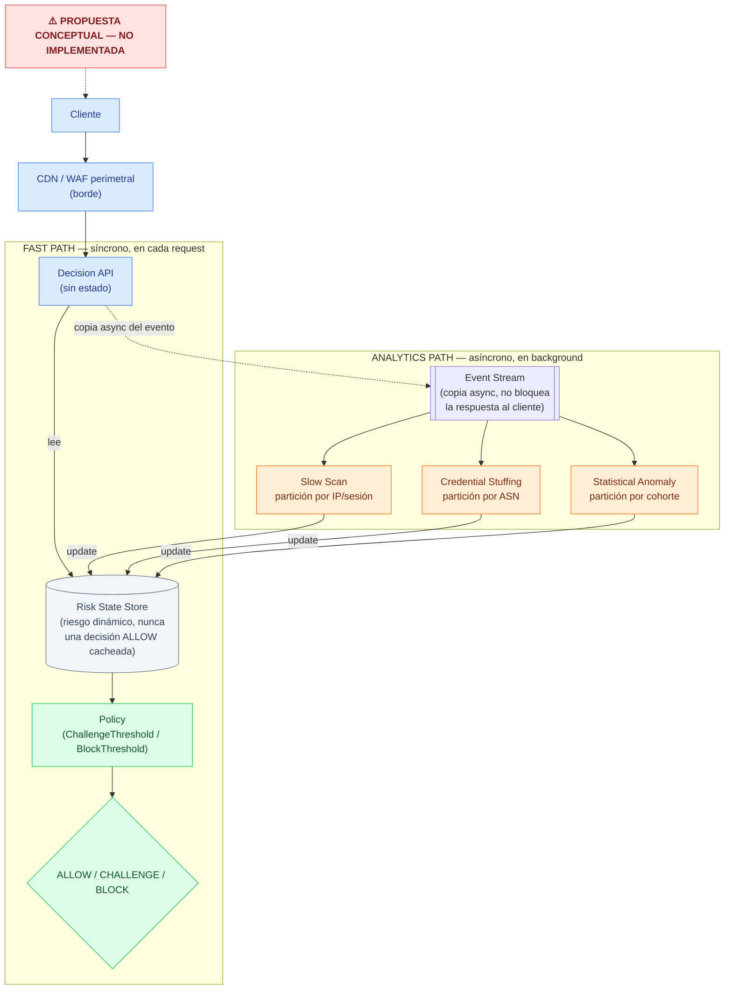

# Escalado conceptual a 1.000 millones de requests/hora

Este documento es una **propuesta conceptual**, sin implementación — describe cómo
escalaríamos la arquitectura actual (`cmd/engine`, un único proceso) a un volumen de
tráfico que un solo proceso no puede manejar. No cambia ninguna lógica de detección:
las fórmulas, `ScoreFloor`, `Policy` y los umbrales ya calibrados en el holdout
se mantienen exactamente iguales. Lo que cambia es **dónde** corre esa lógica y **cómo**
se reparte el tráfico para que cada instancia siga viendo lo que necesita ver.

## 1. El problema, en palabras simples

Hoy, el motor es **un solo proceso** que hace todo junto: recibe el request HTTP,
recuerda el historial de cada IP/sesión/cuenta (en mapas en memoria), corre los tres
detectores, y decide — todo en el mismo lugar, al mismo tiempo.

A la escala de 1.000 millones de requests por hora, eso es imposible en una sola
máquina. Necesitamos **muchas máquinas** atendiendo requests en paralelo.

Acá está el problema real, no obvio a primera vista: si simplemente ponemos 100 copias
del motor de hoy detrás de un balanceador de carga (que reparte requests al azar),
**cada copia solo ve una fracción del tráfico total** — nunca el panorama completo de
una entidad.

Para nuestros dos detectores eso es grave, de formas distintas:

- **Slow Scan** necesita ver TODO el historial de UNA IP/sesión a lo largo del tiempo.
  Si sus requests caen en máquinas distintas, ninguna máquina ve suficiente evidencia —
  el escaneo se vuelve invisible, no porque el algoritmo esté mal, sino porque nunca ve
  los datos juntos.
- **Credential Stuffing** necesita ver actividad de MUCHAS IPs del mismo grupo de red
  (ASN) correlacionada. Si esas 500 IPs de un mismo ataque caen en 500 máquinas
  distintas, cada una ve solo 1 IP — invisible también.

Por eso la solución no es solo "agregar más máquinas" (eso resuelve el volumen bruto).
Hay que repartir **tanto el procesamiento** (quién atiende cada request) **como el
estado** (quién recuerda el historial de qué entidad) de forma que las piezas
relacionadas de una misma historia de ataque terminen siempre juntas, en la misma
máquina.

**Analogía**: pensá en una sala de emergencias de un hospital grande. La enfermera de
triage (camino rápido) no te hace un análisis de sangre completo antes de decidir si
sos urgente — mira tu ficha YA EXISTENTE (signos vitales, historial reciente) y decide
al instante. El laboratorio (camino lento) sí hace los análisis completos, pero en
paralelo, y actualiza tu ficha para la PRÓXIMA vez que alguien te atienda — nunca te
hace esperar en la puerta a que termine.

## 2. Arquitectura propuesta

Dos caminos, con trabajos distintos:

Esta es la misma idea que se resume en el README, con más detalle sobre qué
particiona cada detector y qué es exactamente el Risk State Store.

## 3. Cada componente

### CDN/WAF perimetral

- **Qué es**: una capa de red cerca del usuario, antes de llegar a nuestra
  infraestructura — el "portero en la puerta", en vez de un solo portero para todo el
  edificio.
- **Qué problema tenemos hoy**: todo el tráfico golpea directo al proceso, sin ningún
  filtro previo contra lo obvio (floods simples, IPs ya conocidas como maliciosas).
- **Qué cambiaríamos**: agregar esta capa para absorber tráfico obviamente malicioso
  ANTES de gastar CPU en análisis conductual fino.
- **Por qué ayuda a escalar**: reduce el volumen que el motor conductual (la parte
  cara, con estado) tiene que procesar.
- **Ejemplo aplicado**: un flood simple desde una sola IP se frena en el borde, nunca
  compite por CPU con `internal/credstuffing`/`internal/slowscan`.

### Decision API

- **Qué es**: el punto de entrada que reemplaza a `POST /v1/events` — sin estado
  propio (*stateless*: no guarda nada que otra copia no sepa).
- **Qué problema tenemos hoy**: `cmd/engine` es un único proceso que recibe, analiza
  CON estado, y decide, todo junto — no se puede clonar sin antes resolver qué pasa
  con el estado.
- **Qué cambiaríamos**: la Decision API solo pregunta al Risk State Store "¿qué
  sabemos de esta entidad ahora?", aplica Policy, responde, y manda una copia del
  evento al Event Stream. Nunca corre un detector ella misma.
- **Por qué ayuda a escalar**: algo sin estado se puede clonar cuantas veces haga
  falta — cualquier copia atiende cualquier request.
- **Ejemplo aplicado**: hoy `BehavioralDecider.Decide()` hace todo. Mañana, la
  Decision API solo hace el último paso (mirar el Risk State Store + Policy); los
  detectores migran al Analytics Path.

### Event Stream

- **Qué es**: una cola (fila de espera) que anota, en orden, cada evento — el libro de
  registro de un hotel, que distintos empleados leen después sin interrumpir a quien
  sigue registrando gente nueva.
- **Qué problema tenemos hoy**: no existe — el mismo request que llega es el que se
  analiza, en el mismo instante.
- **Qué cambiaríamos**: la Decision API publica una copia de cada evento acá; los
  detectores leen de la cola, a su propio ritmo.
- **Por qué ayuda a escalar**: desacopla la velocidad de RECIBIR de la velocidad de
  ANALIZAR. Si los detectores se atrasan, la cola crece — el cliente ya recibió su
  respuesta, nunca espera al análisis.
- **Ejemplo aplicado**: hoy, si `internal/anomaly` tarda, el cliente HTTP espera esa
  demora. Con una cola, nunca la nota.

### Slow Scan por IP/sesión

- **Qué es**: el mismo detector de hoy (`internal/slowscan`) — mira el comportamiento
  de UNA IP/sesión en el tiempo.
- **Qué problema tenemos hoy**: su estado (`internal/profile`) vive en el mismo
  proceso que recibe el request.
- **Qué cambiaríamos**: se convierte en "consumidor" de la cola, con una regla clave:
  **partición** (dividir la cola en varios canales, cada uno atendido por una copia
  distinta) por IP/sesión — todos los eventos de la MISMA entidad van SIEMPRE a la
  MISMA copia, porque el detector necesita el historial completo, no fragmentos.
- **Por qué ayuda a escalar**: muchas copias en paralelo, cada una responsable de un
  subconjunto de IPs/sesiones — el trabajo se reparte sin partir ninguna historia por
  la mitad.
- **Ejemplo aplicado**: 50 copias del mismo código; cada IP siempre cae en la misma
  copia por partición.

### Credential Stuffing por ASN

- **Qué es**: el detector de hoy (`internal/credstuffing`) — correlaciona MUCHAS IPs
  del mismo ASN (el bloque de direcciones que administra un proveedor de Internet).
- **Qué problema tenemos hoy**: mismo problema que Slow Scan, pero la unidad de
  agrupación es distinta — acá importa "todas las IPs del mismo ASN juntas".
- **Qué cambiaríamos**: partición de la cola por ASN (no por IP) para este detector —
  requiere conocer el ASN de cada IP ANTES de particionar (ver ASN enrichment cache).
- **Por qué ayuda a escalar**: sin esto, 500 IPs del mismo ataque podrían caer en 500
  máquinas distintas, cada una viendo 1 IP. Particionando por ASN, siempre convergen
  en la misma copia.
- **Ejemplo aplicado**: hoy `credstuffing.Detector` agrupa por
  `resolver.Resolve(ip) → group`. Mañana, ese mismo `group` es la clave de partición.

### Statistical Anomaly por cohorte

- **Qué es**: el detector de hoy (`internal/anomaly`) — compara contra un baseline
  estadístico global (Welford), sin conocer el tipo de ataque de antemano.
- **Qué problema tenemos hoy**: un solo baseline compartido por TODO el tráfico — ya
  vimos en el holdout que a mayor escala eso puede ver a una entidad legítima como
  "rara" solo por azar.
- **Qué cambiaríamos**: dividir el tráfico en "cohortes" (grupos con un perfil de
  comportamiento parecido) y mantener un baseline SEPARADO por cohorte, particionado
  igual que los otros detectores.
- **Por qué ayuda a escalar**: más preciso (compara peras con peras) y más chico por
  partición — reduce el riesgo de falsos positivos de un baseline demasiado grande y
  heterogéneo.
- **Ejemplo aplicado**: hoy hay un `baseline` compartido. Mañana, N baselines (uno por
  cohorte), mismo algoritmo de Welford, aplicado a un grupo más chico.

### Risk State Store

- **Qué es**: una base de datos muy rápida, compartida por TODAS las copias de la
  Decision API, con el **riesgo dinámico más reciente conocido** por entidad — el
  pizarrón compartido en la entrada de un edificio con "sospechosos de hoy", que
  cualquier guardia en cualquier puerta puede consultar al instante.

  **Aclaración importante sobre el nombre**: deliberadamente NO lo llamamos "Risk
  Cache". Un caché típico guarda un resultado ya calculado y lo reutiliza tal cual
  hasta que expira — la implicancia sería "una vez que calculamos ALLOW para esta
  entidad, queda fijo como seguro por un rato". Eso sería incorrecto y peligroso acá:
  lo que guardamos NO es una decisión fija, es un **valor de riesgo dinámico** que
  cualquier detector puede actualizar en cualquier momento, de forma asíncrona, sin
  esperar a que nada "expire" primero. Un ALLOW de hace 2 segundos no es una promesa
  de que esa entidad siga siendo segura — es solo "no había evidencia de riesgo la
  última vez que se calculó". Si un detector encuentra evidencia nueva un segundo
  después, el valor se actualiza de inmediato, y el PRÓXIMO request de esa entidad ya
  ve el cambio (ver la sección de *cold-start* más abajo sobre cuánto puede tardar esa
  primera evidencia en aparecer).

- **Qué problema tenemos hoy**: no hace falta hoy, porque el mismo proceso que decide
  tiene el estado. Distribuido, la Decision API no puede esperar a que un detector (en
  otra parte, más lento) termine.
- **Qué cambiaríamos**: los detectores escriben acá su RiskScore recalculado cada vez
  que cambia (con TTL — tiempo de vida, después del cual el dato se considera viejo y
  se refresca o se descarta). La Decision API SOLO lee.
- **Por qué ayuda a escalar**: separa "calcular el riesgo" (lento, con estado) de
  "consultar el riesgo ya calculado" (rapidísimo, sin estado).
- **Ejemplo aplicado**: hoy `Decide()` calcula el score en el momento. Mañana, la
  Decision API pregunta "¿cuál es el score más reciente?" — si no hay nada (entidad
  nueva), asume el caso seguro por defecto (ALLOW con score 0, igual que hoy cuando
  ningún detector dispara).

### ASN enrichment cache / base de datos local

- **Qué es**: la tabla que traduce IP→ASN, hoy en `internal/asn` (RIPEstat real, o
  resolver simulado en pruebas).
- **Qué problema tenemos hoy**: con RIPEstat real implica una llamada de red externa
  por IP — a 1B req/hora, ninguna llamada externa por request es viable, ni con caché
  por proceso.
- **Qué cambiaríamos**: un caché COMPARTIDO entre todas las máquinas, respaldado por
  una base de datos local de rangos IP→ASN (existen bases públicas descargables,
  consultables 100% en memoria, sin red en el camino crítico).
- **Por qué ayuda a escalar**: convierte una operación que podría ser red externa en
  una consulta local instantánea, compartida entre todas las máquinas.
- **Ejemplo aplicado**: hoy `asn.Resolver` cachea por proceso. Mañana, ese caché se
  vuelve compartido + una copia local de la base IP→ASN.

### Blocklist distribuida + TTL

- **Qué es**: una lista compartida de entidades ya identificadas como maliciosas, con
  TTL (cada entrada expira sola, para no bloquear para siempre por error ni acumular
  infinito).
- **Qué problema tenemos hoy**: no existe — cada request pasa SIEMPRE por el análisis
  completo, aunque esa IP ya fue bloqueada hace 2 segundos.
- **Qué cambiaríamos**: cuando un detector confirma con alta confianza que una entidad
  es maliciosa, la agrega acá además de actualizar el Risk State Store. La Decision
  API la consulta primero.
- **Por qué ayuda a escalar**: evita repetir trabajo caro para tráfico que YA sabemos
  que es malicioso.
- **Ejemplo aplicado**: el request #500 de una IP ya bloqueada ni siquiera llega a los
  detectores — se resuelve al instante.

### Backpressure

- **Qué es** (definición inmediata): lo que pasa cuando una parte del sistema (los
  detectores) no puede seguirle el ritmo a otra (los eventos que llegan) — una tubería
  que recibe más agua de la que puede drenar. Backpressure es el mecanismo para
  DETECTAR ese desborde a tiempo y reaccionar, antes de que el sistema colapse sin
  avisar. Una métrica clave acá es el **consumer lag**: cuánto atraso (en tiempo o en
  cantidad de eventos) tiene quien LEE la cola respecto a quien ESCRIBE en ella.
- **Qué problema tenemos hoy**: no aplica — un solo proceso no puede atrasarse
  respecto a sí mismo; si se satura, responde más lento a todo por igual.
- **Qué cambiaríamos**: medir el consumer lag y tener una estrategia cuando crece
  demasiado (agregar más copias de detectores automáticamente, o como último recurso,
  priorizar el tráfico de mayor riesgo aparente).
- **Por qué ayuda a escalar**: sin esto, el Analytics Path se atrasaría
  silenciosamente, y el Risk State Store quedaría con información vieja sin que nadie
  se entere — el sistema fallaría "en cámara lenta", invisible.
- **Ejemplo aplicado**: un pico de tráfico real hace crecer la cola más rápido de lo
  que los detectores procesan — se mide ese atraso como una métrica más (junto a las
  ya existentes de OTel) y dispara alerta/autoescalado antes de que el Risk State
  Store quede desactualizado.

### Observability

- **Qué es**: la capacidad de ver qué pasa adentro sin adivinar — ya existe una
  versión (OTel + Prometheus + Grafana) para un solo proceso.
- **Qué problema tenemos hoy**: cubre UN proceso. Distribuido, "¿está todo bien?" pasa
  a ser una pregunta sobre el sistema completo — hace falta ver cosas nuevas: atraso
  por partición, particiones "calientes" vs "frías", latencia del Risk State Store.
- **Qué cambiaríamos**: extender la misma base de OTel con consumer lag por
  partición/detector, latencia del Risk State Store, tasa de aciertos/fallos del
  store (*cache hit/miss* — aunque no sea un caché fijo, igual tiene sentido medir
  cuántas consultas encuentran un valor ya calculado vs. caen al default), salud por
  partición.
- **Por qué ayuda a escalar**: sin esto, un sistema de esta escala es imposible de
  operar con confianza — los problemas tienen que ser visibles antes de convertirse en
  una falla de detección silenciosa.
- **Ejemplo aplicado**: el mismo dashboard de Grafana se extiende con paneles de
  consumer lag y latencia p95/p99 del Risk State Store.

### High availability (alta disponibilidad)

Ver la sección dedicada 5 más abajo — acá solo el resumen de una línea: que el
sistema siga funcionando (aunque degradado) cuando una parte falla, sin que ningún
componente sea un punto único de falla.

## 4. Limitación estructural: cold-start y su relación con el detection delay

Ningún detector conductual (centralizado o distribuido) puede identificar una entidad
maliciosa en su PRIMER request — necesita acumular evidencia (varios requests de la
misma IP, varias IPs del mismo ASN, etc.) antes de que el patrón sea reconocible. A
esto lo llamamos **cold-start**: una entidad nueva no tiene ninguna historia
conductual todavía, así que sus primeras requests van a pasar (ALLOW) mientras se
acumula esa evidencia — no porque el sistema esté fallando, sino porque literalmente
no hay nada que analizar todavía.

Esto es exactamente el mismo fenómeno que ya medimos empíricamente como **detection
delay** (`RequestsToDetection`/`TimeToDetection` en `internal/tuning`): en
tuning/holdout, la detección eventual de una campaña de
Credential Stuffing tardó, en mediana, alrededor de 24-26 requests desde el primer
evento de la campaña; Slow Scan detectó bastante más rápido, típicamente entre 3 y 10
requests, según el candidato y el ratio. Ese delay no es un defecto de la
implementación — es inherente a CUALQUIER detector que decide en base a patrones
observados, y ya está cuantificado con datos reales en nuestros propios reportes de
tuning (`reports/tuning/`) y holdout (`reports/holdout/`).

**Distribuir la arquitectura no agrega cold-start nuevo, pero tampoco lo elimina.**
El Risk State Store guarda el riesgo YA calculado; para una entidad que nunca generó
tráfico antes, no hay nada guardado (o hay un valor "sin evidencia"), así que la
Decision API cae al default seguro (ALLOW) igual que hoy. La diferencia distribuida es
sutil pero real: como la partición correcta (por IP/sesión, por ASN, por cohorte)
garantiza que TODA la evidencia de una entidad llega siempre al mismo detector, el
cold-start en el sistema distribuido debería tardar **lo mismo** que en el sistema de
hoy — el riesgo real es que una partición MAL diseñada (por ejemplo, particionar por
IP individual en vez de por ASN para Credential Stuffing) alargue artificialmente ese
delay, porque ningún detector individual volvería a ver el panorama completo. Esa es
justamente la razón por la que la partición por ASN/IP-sesión/cohorte no es un detalle
de implementación menor, sino la pieza central de todo este diseño (sección 1).

## 5. Alta disponibilidad: fail-open vs. fail-closed, componente por componente

Antes de definir qué hace cada componente cuando falla, dos términos:

- **Fail-open**: cuando un componente falla, el sistema sigue funcionando de forma
  MENOS estricta (por ejemplo, deja pasar tráfico sin ese chequeo) — prioriza
  disponibilidad sobre seguridad para esa falla puntual.
- **Fail-closed**: cuando un componente falla, el sistema se vuelve MÁS restrictivo
  por defecto (bloquea o exige fricción) — prioriza seguridad sobre disponibilidad
  para esa falla puntual.

Ninguna de las dos es "la correcta" en abstracto — depende de qué componente falló y
qué tan grave es equivocarse en cada dirección. Por eso el comportamiento se define
explícitamente, componente por componente, nunca como una regla única para todo el
sistema:

| Componente | Si falla/no responde a tiempo | Modo | Por qué |
|---|---|---|---|
| CDN/WAF perimetral | El tráfico sigue de largo sin ese filtro grueso | Fail-open | Las capas siguientes (Decision API + detectores) todavía pueden actuar; perder el filtro perimetral no deja al sistema ciego, solo más cargado |
| ASN enrichment cache | Ese request no puede resolver ASN | Fail-open, acotado | Mismo criterio que `credstuffing.UnavailableNetworkResolver` ya implementado hoy: Credential Stuffing queda inerte SOLO para esa IP sin resolver, el resto del sistema sigue funcionando |
| Blocklist distribuida | No se puede hacer el bloqueo rápido por lista conocida | Fail-open sobre el ATAJO, no sobre la seguridad | La entidad sigue pasando por el camino normal (Risk State Store); si un detector ya la había marcado como riesgosa antes, esa marca sigue en el Risk State Store — se pierde el atajo rápido, no la protección de fondo |
| Event Stream / detectores (Analytics Path) | No llegan actualizaciones nuevas de riesgo | Fail-open para evidencia NUEVA, nunca fail-closed | El Fast Path no depende síncronamente del Analytics Path — sigue respondiendo con el último riesgo conocido en el Risk State Store; el costo es que ese riesgo deja de actualizarse hasta que el Analytics Path se recupera (ver backpressure/observability para detectar esto a tiempo) |
| Risk State Store | La Decision API no puede leer el riesgo de una entidad | **Degradación controlada — ver abajo** | Es el componente más sensible: es el único que está en el camino de CADA request del Fast Path |

### El caso especial: caída del Risk State Store

Acá el trade-off disponibilidad vs. seguridad es real y hay que decirlo explícito, no
esconderlo detrás de un genérico "default seguro":

- **Fail-closed puro** (CHALLENGE o BLOCK a todo mientras el store no responde)
  maximiza seguridad, pero convierte la caída de UN componente en una caída efectiva
  de TODO el servicio para tráfico legítimo — exactamente el punto único de falla que
  toda esta arquitectura está tratando de evitar. A 1B req/hora, eso es una
  indisponibilidad masiva autoinfligida por una sola dependencia.
- **Fail-open puro** (ALLOW a todo mientras el store no responde) maximiza
  disponibilidad, pero durante esa ventana el sistema no tiene NINGUNA protección
  conductual — cualquier atacante activo justo en ese momento pasa sin control.

La propuesta es una **degradación controlada**, ni todo-abierto ni todo-cerrado para
el sistema entero:

1. **La Blocklist (más chica, más barata de mantener altamente disponible que el Risk
   State Store completo) se sigue consultando aparte.** Entidades ya confirmadas como
   maliciosas siguen bloqueándose aunque el Risk State Store esté caído — la
   protección más importante (contra lo YA CONFIRMADO) es la que menos se puede
   perder.
2. **Para el resto del tráfico, el default durante la caída es CHALLENGE, no ALLOW ni
   BLOCK.** Es la misma filosofía que ya justifica `Policy` hoy: un CHALLENGE es
   fricción barata, no una molestia grave como un BLOCK — durante una caída del store,
   se acepta más fricción de la habitual a cambio de no perder disponibilidad total ni
   protección total.
3. **La caída se hace ruidosa a propósito** (observability): un Risk State Store
   caído dispara alertas inmediatas, precisamente porque es el componente más crítico
   — la degradación controlada es aceptable como respuesta de segundos/minutos, nunca
   como un estado normal de operación prolongado.
4. **El propio Risk State Store se diseña con alta disponibilidad real** (redundado,
   en varias zonas) para que este escenario sea raro y breve — la degradación
   controlada es la red de seguridad para cuando igual pasa, no una excusa para no
   invertir en la disponibilidad del store en primer lugar.

Este trade-off (más fricción para todos durante una caída, a cambio de no perder ni
disponibilidad total ni seguridad total) es una decisión de producto explícita, no un
detalle técnico — queda documentada acá para que se pueda revisar y ajustar
conscientemente, no descubrir por accidente en un incidente real.

## 6. Flujo paso a paso de una request

1. Un cliente (o un atacante) hace un request HTTP.
2. El CDN/WAF perimetral lo recibe primero — si es un ataque obvio, lo frena ahí,
   nunca llega más lejos.
3. Llega a una de las muchas copias de la Decision API (cualquiera puede atenderlo).
4. La Decision API resuelve el ASN (caché local, sin red) y consulta la Blocklist
   distribuida — si ya está bloqueada, responde BLOCK ahí mismo.
5. Si no, consulta el Risk State Store: "¿cuál es el riesgo más reciente conocido de
   esta IP/sesión/cuenta/ASN?" (para una entidad nueva, no hay nada guardado — ver
   cold-start, sección 4).
6. Aplica Policy (los mismos umbrales Challenge/Block de siempre) y responde
   ALLOW/CHALLENGE/BLOCK — todo en milisegundos, sin correr ningún detector en este
   momento.
7. En paralelo, sin que el cliente espere nada, publica una copia del evento en el
   Event Stream.
8. El Event Stream reparte ese evento respetando las particiones: por IP/sesión para
   Slow Scan, por ASN para Credential Stuffing, por cohorte para Statistical Anomaly.
9. Cada detector procesa el evento con su lógica de siempre — las mismas ventanas
   deslizantes, el mismo ScoreFloor, el mismo código conceptual de hoy.
10. Si cambia el veredicto de riesgo, el detector actualiza el Risk State Store (y la
    Blocklist, si corresponde).
11. El **próximo** request de esa misma entidad (que puede llegar a cualquier copia de
    la Decision API) va a ver ese veredicto actualizado en el paso 5.

Esto implica un pequeño desfasaje entre "el detector calculó algo nuevo" y "la
Decision API ya lo ve" — se llama **eventual consistency** (definición inmediata: por
un rato, distintas partes del sistema pueden no estar de acuerdo sobre el estado más
reciente de algo, pero eventualmente — en segundos, normalmente — todas terminan
viendo lo mismo). Es el costo de separar el camino rápido del análisis pesado, y hay
que decirlo explícitamente, no esconderlo.

## 7. Qué cambia respecto al proyecto actual y por qué

| Hoy | Propuesto | Por qué |
|---|---|---|
| Un solo proceso hace HTTP + detección + decisión | Decision API (sin estado) separada de los detectores (con estado, distribuidos) | Solo lo que no tiene estado se puede clonar libremente |
| Los detectores calculan el riesgo EN el momento del request | Calculan en background, leyendo una cola; la decisión lee un resultado ya calculado | El camino que responde al cliente no puede depender de un análisis que puede tardar |
| El estado vive en mapas dentro de un mismo proceso | El estado se reparte por partición (IP/sesión, ASN, cohorte) entre copias del mismo detector | Ninguna máquina sola guarda el estado de 1B req/hora, pero sí el de "su" partición |
| ASN se resuelve por proceso, caché propio | Caché/base de datos IP→ASN compartida entre todas las máquinas | Resolver la misma IP en cada máquina por separado desperdicia trabajo |
| Sin blocklist — cada request repite el análisis completo | Blocklist distribuida con TTL, consultada antes del análisis | No hay que volver a demostrar que alguien ya identificado es malicioso |
| Sin backpressure — no puede atrasarse respecto a sí mismo | El Analytics Path puede atrasarse; se mide (consumer lag) y se gestiona explícitamente | Separar los caminos introduce la posibilidad de atraso; hay que verlo antes de que sea un problema |
| Observabilidad de un solo proceso | Observabilidad de sistema distribuido (lag, cache hit/miss, salud por partición) | "¿Está todo bien?" ahora es una pregunta sobre cientos de máquinas |
| Sin alta disponibilidad — un solo punto de falla, sin política de falla definida | Cada componente redundado, con fail-open/fail-closed explícito por componente (sección 5) | A esta escala, algo se rompe todo el tiempo; tiene que ser normal y manejable, con el trade-off disponibilidad/seguridad decidido a propósito, no por accidente |
| El cold-start ya existe, pero nunca se documentó como limitación explícita | Se documenta explícitamente (sección 4), conectado al detection delay ya medido en tuning/holdout | Distribuir no lo resuelve ni lo empeora — pero hay que decir que sigue existiendo |
| **Policy, ScoreFloor, umbrales calibrados (tuning/holdout)** | **Se mantienen EXACTAMENTE igual** | Este documento es sobre escalar el *cómo*, nunca sobre cambiar el *qué* se decide |

La lógica de cada detector (fórmulas, ScoreFloor, Policy, los umbrales ya calibrados
en el holdout) no cambia en absoluto — lo que cambia es **dónde** corre
esa lógica y **cómo** se reparte el tráfico para que cada instancia siga viendo lo que
necesita ver.

## 8. Alcance de este documento

Es una propuesta conceptual — no se implementó ninguna infraestructura distribuida, no
se agregó ninguna dependencia nueva, y no se modificó ningún detector, threshold,
Policy ni ScoreFloor del proyecto actual. Sirve como respuesta a "¿cómo escalarías
esto a 1B requests/hora?", no como un plan de trabajo con fechas.
